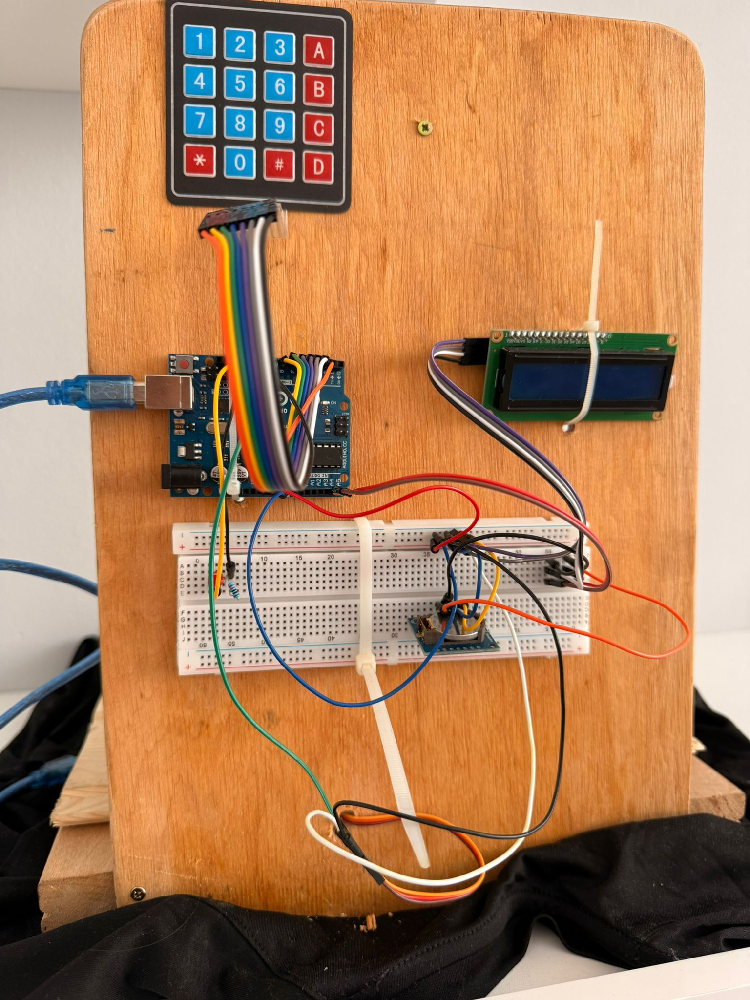

# 🐾 Automatic Pet Feeder (Arduino)

An automated pet feeding system built using Arduino that dispenses food at a scheduled time using a servo motor and real-time clock.

The system allows the user to set feeding time and portion size using a keypad and displays information on an LCD screen.

---

##  Project Preview

###  Hardware Setup

###  Feeding Mechanism

---

##  Features

-  Scheduled feeding using RTC (DS1307)
-  Adjustable portion size (Small / Large)
-  Time setup via keypad
-  LCD feedback interface
-  LED indicator during feeding
-  Manual food release option

---

##  How It Works

The user sets:

- Feeding time (HHMM format)
- Portion size:
  - `A` → Large
  - `B` → Small

At the selected time:

- The servo rotates to release food
- LED turns on during feeding
- Feeding happens once per day

Manual release is available using:

- `C` → Manual food release

---

##  Components Used

- Arduino
- RTC DS1307
- Servo Motor
- LCD 16x2 with I2C
- 4x4 Keypad
- LED

---

##  Usage

Press:

- `*` → Set feeding time  
- `A` → Large portion  
- `B` → Small portion  
- `C` → Manual feeding  

---

## 📚 Future Improvements

- Multiple feeding times
- Food level sensor
- Mobile control
